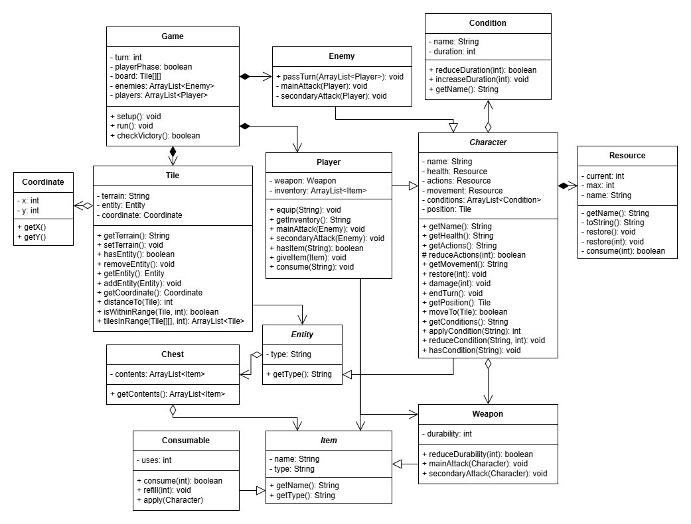

# Technical Details:

The design of this game is similar to that of the final project from last semester, but an expanded version. There will be multiple instances of abstract classes. BFS will be used in order to determine the locations where a player can move with a certain number of steps.

Critical Features:
- Grid-based character movement
- Turn cycle with a player phase and an enemy phase
- Ability to damage and kill other characters

Additional Features:
- Character stats (strength, speed, block, etc) and unique classes
- Additional modifiers (poisoned, paralyzed, burning)
- Terrain to hinder movement and provide attack benefits
- Equipment and consumable systems
- Chests with health potions / equipment / scrolls
- Action point system
- Attack range and multi-target attacks
- Magic vs. physical damage
- Spells to modify terrain

# Project Design

The key classes (besides game) are tile and character. Tiles make up the board, and characters are able to move from title to tile and interact with other characters. Items will be one of the additional features and weapons in particular will determine different attacks. Player movement will be determined withn the Game class, which includes displaying the range of movement. When we add attacks that have a specified range (we intend on it being orthogonal in the base game), the UML diagram will probably expand to include an Attack class with information like range that will be contained within the Weapon class. The only kind of confusing thing is that Character stores the tile it is on, and Tile stores the Character it is on. That way, it is possible for the player to click on a tile and attack the Character on said tile, and also for Characters to check what terrain they are sitauted on. The code for enemy targetting is stored within the Enemies list, and initially Enemies will decide who they attack based on whoever is closest (done by Manhattan distance). When terrain with movement costs are implemented, board will have to passed to enemies. (It is a choice to keep board non-static that we might change should it prove too constricting.) More instance variables will also be added to the UML diagram as we add character-specific attributes such as movement speed. 
    
# Intended pacing:

How you are breaking down the project and who is responsible for which parts.

A timeline with expected completion dates of parts of the project. (CHANGE THIS!!!!!)

Phase 1 (To be Completed by 5/25)
- Grid-based character movement (James)
- Turn cycle with a player phase and an enemy phase (Simon)
- Ability to damage and kill other characters (Simon)

Phase 2 (To be Completed by 5/29)
- Equipment and consumable system (James)
- Action point system (Simon)
- Chests with health potions / equipment / scrolls (James)
- Additional modifiers (Simon)

Phase 3 (To be Completed by 6/2)
- Magic vs. physical damage (Simon)
- Character stats and unique classes (Simon)
- Terrain to hinder movement and provide attack bonuses (James)
- Spells to modify terrain (James)
- Attack range and multi-target attacks (James)